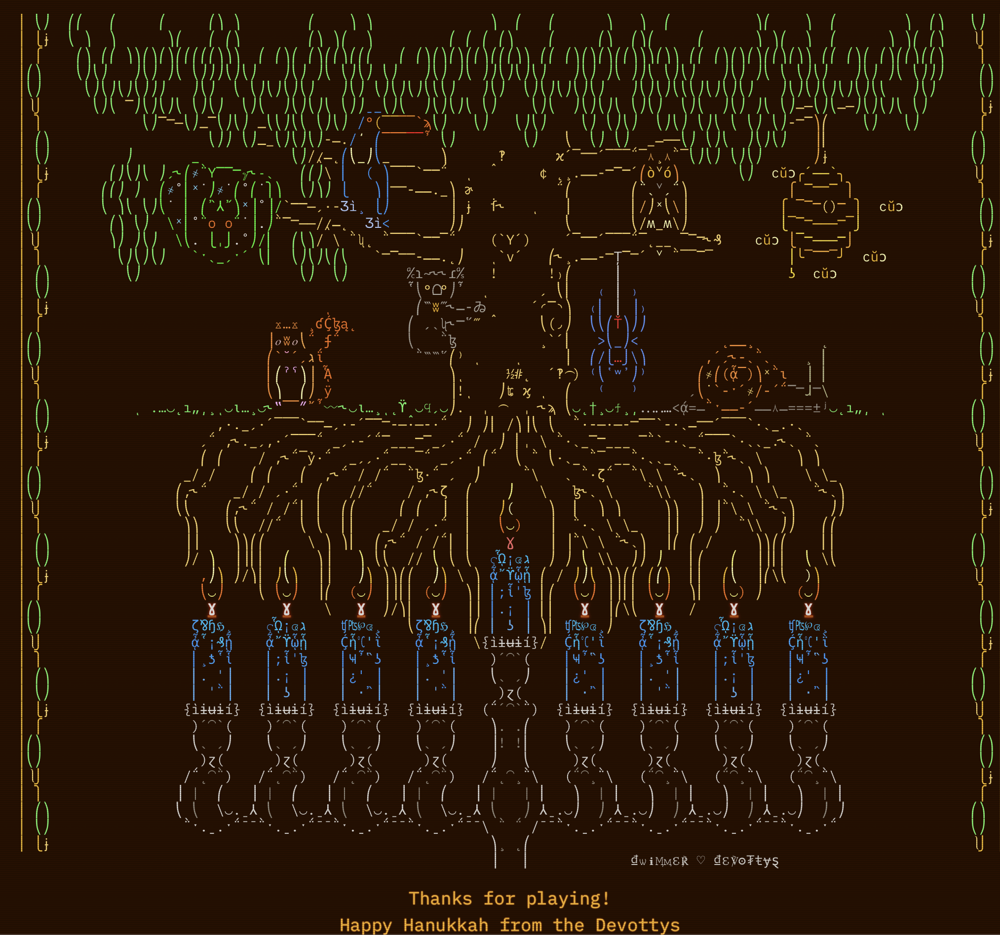

This repository contains my solutions in Python to the really fun [Hanukkah of
Data 2022](https://hanukkah.bluebird.sh/) challenges. Pandas is particularly
well-suited to this challenge so that's what I used.

Here's a picture of the final "reward" and proof that all the solutions
actually work! Note that to run them successfully, you will need to download
the [data](https://hanukkah.bluebird.sh/5783/data/) and figure out the password
to unzip it. That should be fairly straightforward.

